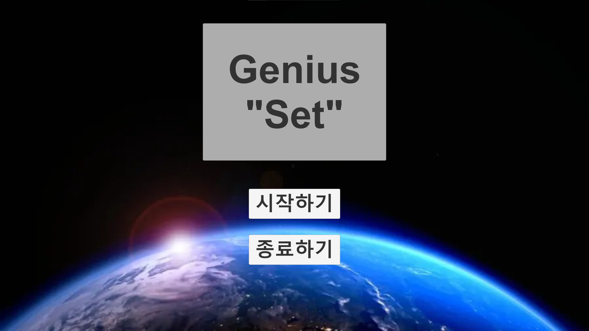
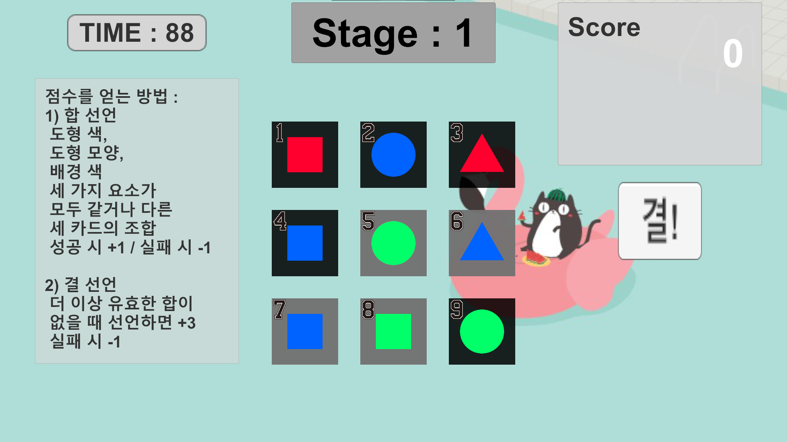

<b>1. 프로젝트 소개</b>

이 프로젝트는 한국에서 방영된 인기 프로그램 <더 지니어스> 시리즈에 나왔던 게임 <결! 합!>을 유니티를 통해 구현한다.  
<결! 합>은 보드게임 <세트>를 기반으로 만들어진 게임이며, 9 장의 카드를 보고 각 세 가지 속성이 모두 같거나 다른 세 장의 카드를 골라내야 하는 게임이다.  
카드가 가진 세 가지 속성은 배경색, 도형의 모양, 도형의 색이다.  
따라서 배경색이 모두 같거나 다르며, 도형의 모양이 모두 같거나 다르며, 도형의 색이 모두 같거나 다른 세 장의 카드를 골라내면 된다. 이러한 행위를 "합"이라고 한다.  
"합"으로 선언된 카드 조합을 다시 "합"으로 선언할 수 없다.  
플레이어는 제시된 9 장의 카드에서 더 이상 "합"을 선언할 수 없다고 생각될 때 "결"을 선언할 수 있다.  
 
이번 프로젝트는 <결! 합!> 게임을 유니티에서 홀로 플레이하는 게임으로 구현하고자 한다.

<b>2. 사용한 프로그램</b>

Unity 2022.3.20f1  
IDE : Visual Studio 2022

<b>3. 세부 규칙</b>

게임은 한 스테이지 당 90초, 총 10 스테이지로 구성되어있다.  
플레이어는 스테이지마다 갱신되는 카드 9 장으로 <결! 합!>을 진행해야 한다.  
1) 카드의 속성  
	카드의 속성은 배경색, 도형의 색, 도형의 모양이 있다.  
	배경색 : 검정 / 회색 / 하양  
 	도형색 : 빨강 / 초록 / 파랑  
	도형모양 : 네모 / 세모 / 원  
3) 합  
	카드의 세 가지 속성을 비교하여, 각 속성이 모두 같거나 다른 세 카드의 조합을 의미한다.  
	성공적으로 합을 선언하면 1점을 획득하며, 아래에 어떤 합을 찾았는지 갱신해준다.  
	중복된 합을 선언하거나 잘못된 합을 선언하면 -1점을 획득한다.  
4) 결  
	더 이상 새로운 합을 선언할 수 없다 판단될 시, 결을 선언할 수 있다.  
	성공적으로 결을 선언하면 3점을 획득하며, 다음 스테이지를 바로 시작한다.  
	잘못된 결을 선언하면 -1점을 획득하며, 2초간 카드 선택이나 결 선언을 할 수 없다.  
	게임이 종료되면, 이번에 획득한 점수와 최고 점수가 출력된다.

<b>4. 프로그램의 장점</b>

<ul>
	<li>모든 해상도 지원</li>
	어떤 해상도에서 플레이하더라도 오브젝트의 위치가 변경되지 않는다. Prefab - Main Camera의 Class FixedRect가 이 기능을 지원한다.  
</ul>

<b>5. 구현할 때 특히 공들인 점</b>

<ul>
	<li>정적 변수를 활용하지 않음</li>
	정적 변수를 사용하지 않고 구현해보려 노력했다.  
	정적 변수는 객체 지향을 해치고, 자주 사용하지 않는 것이 바람직하다는 생각에서였다.  
	<li>직관적인 구성</li>
	게임의 구성을 직관적으로 하여, 받아들이기 쉽게 하려 노력했다.  
</ul>

<b>6. 프로그램에 개선이 필요한 점</b>

<ul>
	<li>싱글턴 디자인</li>
	앞서 얘기했듯 정적 변수를 전혀 사용하지 않아, 서로 다른 객체가 동일한 객체를 호출하도록 하는 것이 쉽지 않았다.  
	이런 것은 클래스 자신의 주소를 인스턴스화하여 해결할 수 있는데, 다음부턴 그러한 방식으로 프로그램을 작성해야겠다.  
	<li>보상의 부재</li>
	게임을 하더라도 어떠한 보상이 주어지지 않는다.  
	현재 생각 중인 방안으로는 획득한 점수를 모아두었다가, 카드 스킨을 구매할 수 있도록 하면 좋겠다.  
	간단한 스킨은 50 ~ 150점, 예쁜 스킨은 500점 정도로 하고, 후에 게임을 출시하게 된다면 광고나 인게임 구매로도 이을 수 있을 것 같다.  
	<li>멀티 플레이</li>
	현재 화면 좌측에 있는 플레이 방법 칸은 사실 멀티 플레이시 서로 채팅을 할 수 있는 공간으로 배치해두었다.  
	다만, 멀티 플레이를 구현하지 않게 되어 해당 빈 자리를 플레이 방법으로 채워넣어둔 상태다.  
	멀티 플레이를 구현하게 된다면, 프로필 꾸미기같은 것도 상점에 추가할 수 있을 듯 싶다.  
	<li>다양한 모드 추가</li>
	현재 만들어진 스테이지 형식 말고 타임어택이나, 원 찬스같은 모드도 만든다면 게임이 더 풍성해질 듯 싶다.  
	<li>일시정지 구현</li>
	구현 단계에서 딱히 필요성을 못 느껴 구현하지 않았지만, 출시해야 한다면 꼭 추가해야할 기능하다.  
</ul>

<b>7. 기타</b>

음원은 chocis 사이트에서, 특히 Sakura Girl의 노래를 많이 사용했습니다.  
https://www.chosic.com/free-music/all/?keyword=Sakura+Girl&artist  
 
게임에 사용된 이미지는 인터넷에서 무료로 사용 가능한 윈도우 배경화면 모음집에서 구했습니다.  
